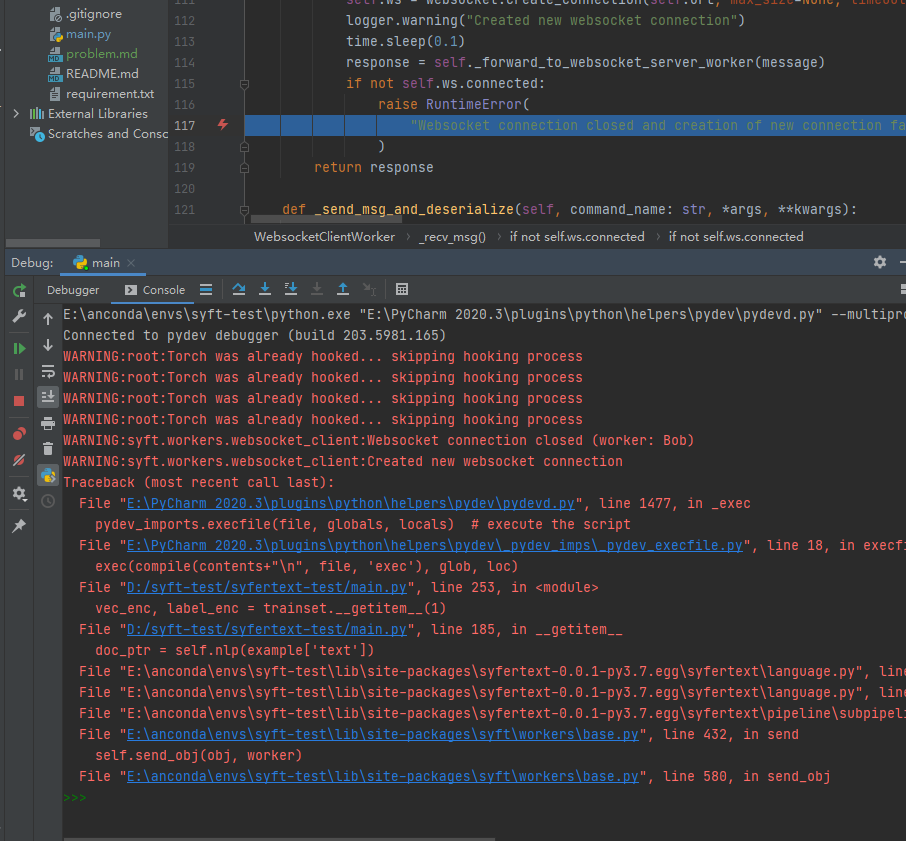
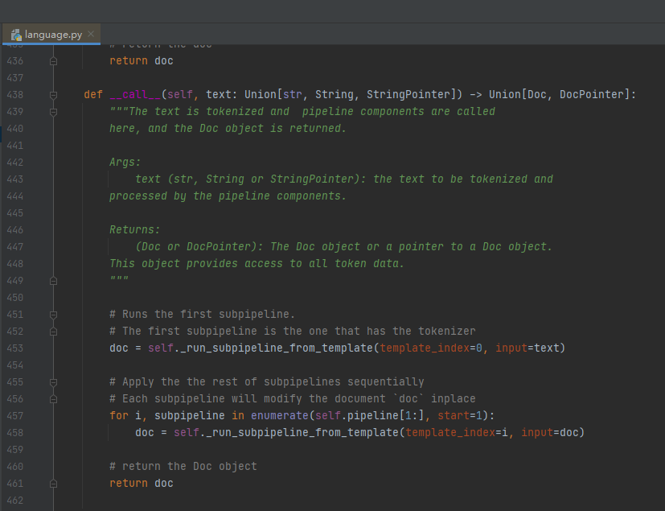
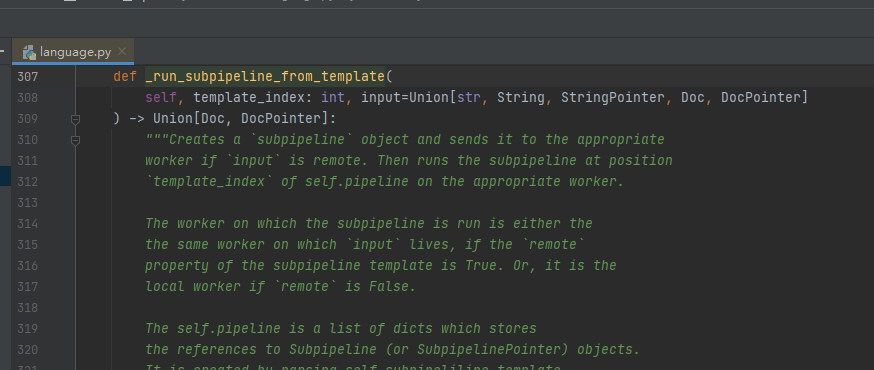
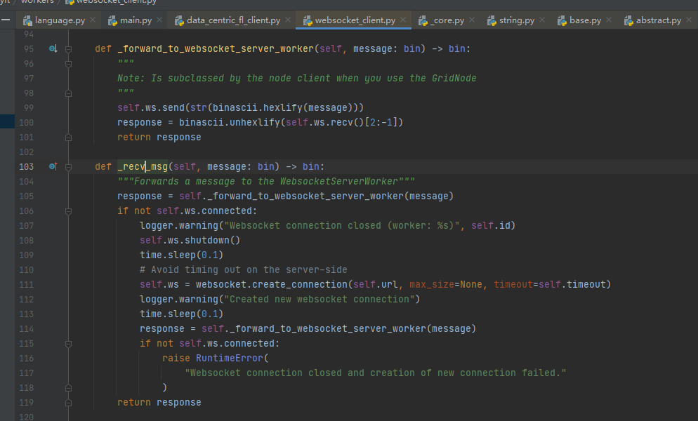
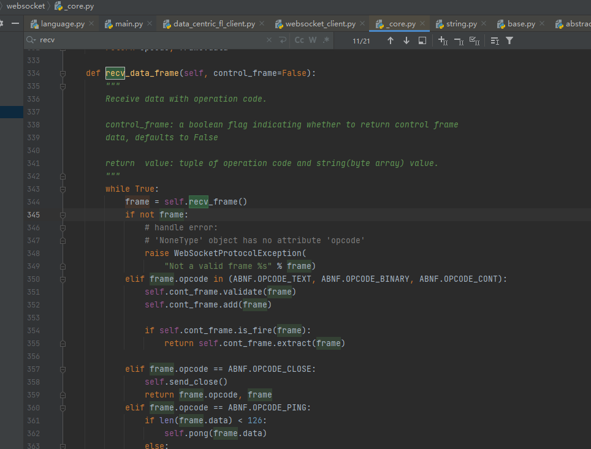

# 真实环境问题

## pysyft

### 安装版本及方式
```shell
pip install syft==0.2.8 \\用此命令安装syft 0.2.8版本  
```

## pygrid
### 安装版本及方式

#### 1.下载官方源码
```shell
git clone git@github.com:OpenMined/PyGrid.git
```

#### 2.切换分支并制作镜像
```shell
git checkout master
docker build ./apps/node/ -f ./apps/node/Dockerfile -t pygrid:node \\制作node节点image
docker build ./apps/network/ -f ./apps/network/Dockerfile -t pygrid:network \\制作network节点image
```

#### 3.修改compose.yaml文件

openmined/grid-network:production改为pygrid:network

openmined/grid-node:production改为pygrid:node

note:node节点并没有注册到network，所有测试代码用的privatenetwork方式
#### 4.启动集群
```shell
docker-compose up
```

## syfertext
## 安装版本及方式
#### 1.下载官方源码
```shell
git clone git@github.com:OpenMined/SyferText.git
```

#### 2.切换分支并安装
```shell
pip install git+git://github.com/Nilanshrajput/syfertext_en_core_web_lg@master
git checkout update_additive_sharing
python setup.py install
```

## 测试代码及问题
测试用的代码即本源码的real分支中的main.py

### 1.出现的错误


### 2.debug的尝试和猜测

#### 2.1问题定位

错误出现在main.py代码的第185行


此处的example['text]及StringPointer类型的值，传递给syfertext库的nlp函数，nlp函数创建pipe并将StringPointer用
websocket发送给node节点，在发送此指针后，websocket就异常关闭导致1中的错误，以下为函数调用链

##### 图1 syfertext language



##### 图2 创建pipe并发送StringPointer



##### 图3 用应用层的websocket客户端发送数据



##### 图4 用传输层的tcp套接字发送字节流



#### 2.2问题分析

图4中357行发现接受到的websocket的操作码为关闭码，即关闭了websocket的连接，所以导致了图3中186行的if语句为真，
重连socket以后发送依然重复上述过程，最后导致错误抛出。

#### 2.3问题排查

#### 2.3.1查看是否pygrid的node发送了websocket关闭报文

1.用pycharm手动启动一个node节点，在所有发送关闭报文的代码处打上断点，发现没有进入任何断点，猜测不是node主动发送了关闭报文。
为了排除是有的发送关闭报文的代码被我忽略了，所以用wireshark抓websocket包验证猜测

2.用wireshark抓包，发现没有StringPointer的发送报文也没有node发送的关闭报文，猜测正确

3.报文发送以后代码没有报错，并且发送后读到了关闭的报文，但wireshark却没有对应的包，至此debug一筹莫展

