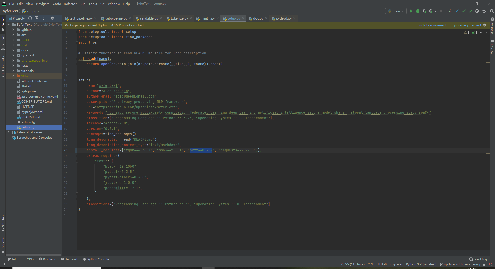
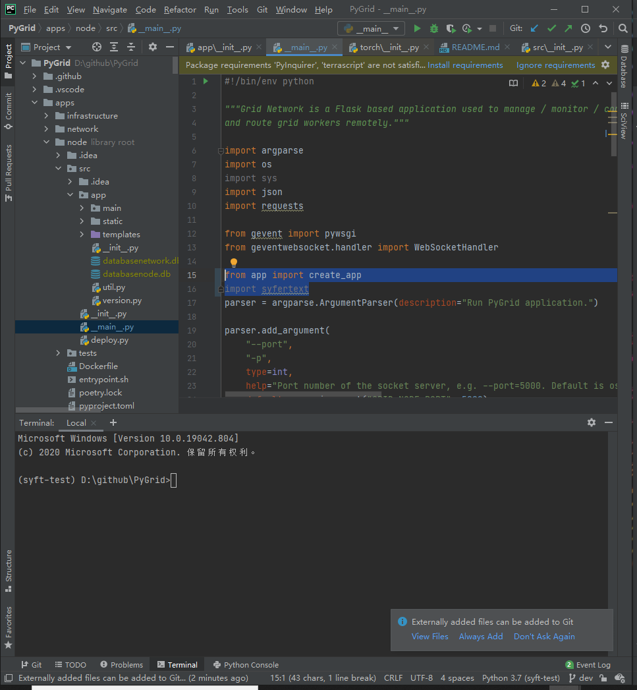
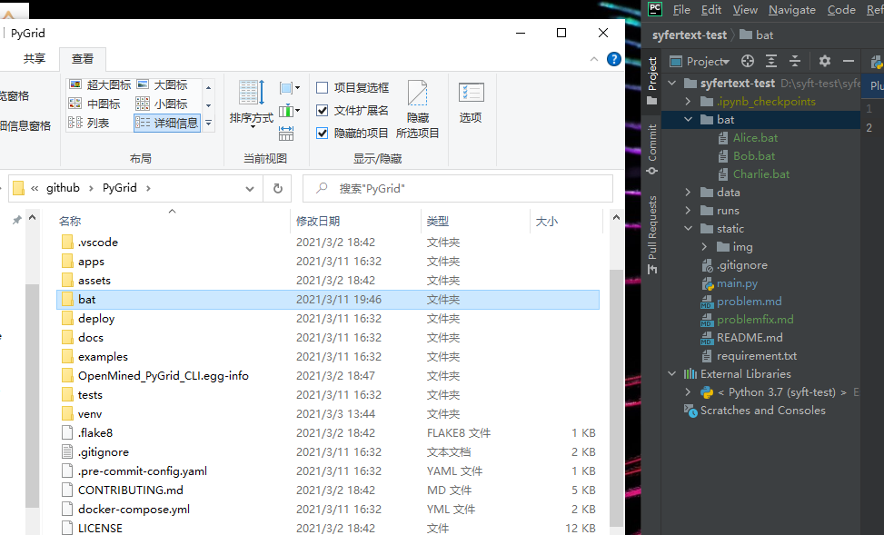
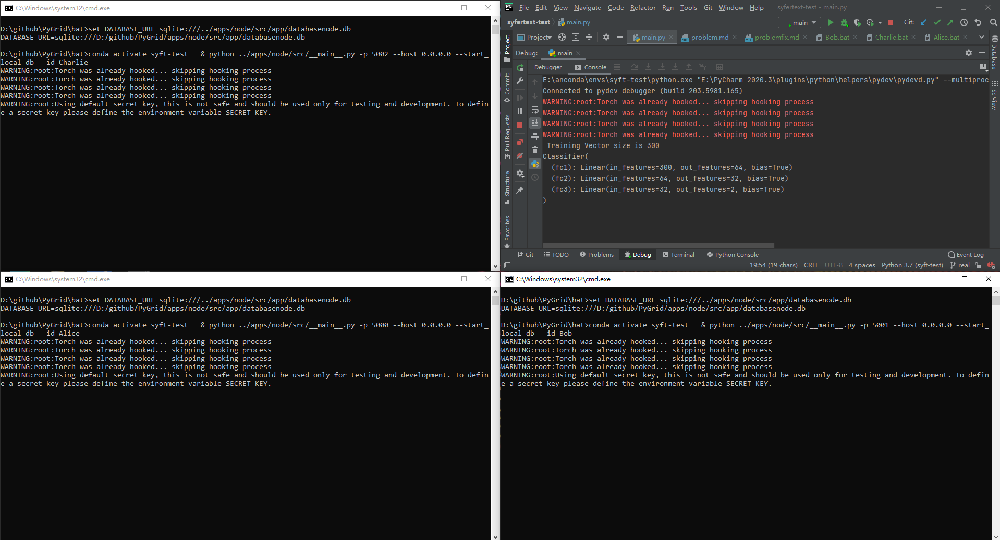
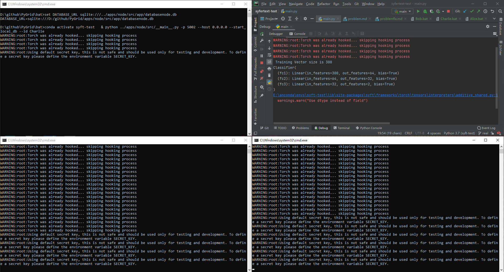

# 真实环境bug修复

详细的debug及分析过程，由于时间原因此处不过多描述。目前只给出修改方式

## syft依赖版本修改
案例代码需要发送DataCentricFLClient类型的消息，syft0.2.8版本不支持，所以需升级到0.2.9版本

```shell
conda activate syft-test  #切换到syft-test环境
pip install syft==0.2.9  #安装0.2.9版本,0.2.8版本回被自动卸载
```

## main.py中的使用的函数需要修改
目前已经修改好了，本分支的代码已经改好了，需要对照之前看一下改动就可以了

```shell
git reset  (commit历史)  #用这个命令就可以看之前的历史了,记不得之前怎么回事可以切换回去看看
```

## 安装syfertext
之前已经安装过syfertext这里就不用管了，如果是没有装syfertext这里要安装就必须修改依赖，否则上一步安装的syft0.2.9会被覆盖

- 安装整体过程还是和readme.md中的方法一样但是在运行下面命令之前，需要把setup.py文件中的依赖改成0.2.9版本
```shell
python setup.py install 
```

如下图所示


## 修改pygrid
修改很简单，但是要知道怎么改，很困难

note: 首先要进入pygrid项目文件夹之下
### 1.切换分支
之前用的master分支，基于syft0.2.8版本，现在要切换到基于syft0.2.9版本的dev分支
```shell
git checkout dev
```

### 2.修改代码
- 在apps/node/src/__main__.py里加入一行import syfertext(为什么加入这个就可以了，这和这个框架对消息的处理设计有关，这里不细讲了)
- 在apps/node/src/__main__.py中from .app import create_app改成from app import create_app

如下图所示



### 3.启动pygrid节点
之前说的启动方式是用docker,但是我懒得写Dockerfile了，就用命令行的方式启动吧。

- 把本项目的bat文件夹复制到pygrid工具目录下
- 进入pygrid文件夹，双击就可以启动了，三个文件每个文件启动一次，每个文件对应一个node

流程如下

复制bat



运行节点


### 4.启动测试
运行本项目的main.py函数就可以了

note: 用pycharm去直接运行node，可能回出现内存不足的情况，反正我8g内存是爆炸了的

运行效果如下

刚启动时



过一会Bob和Alice节点回打印warnning,只要不报错就没有问题，再等几十秒，测试代码就会输出训练过程，至此程序调通


